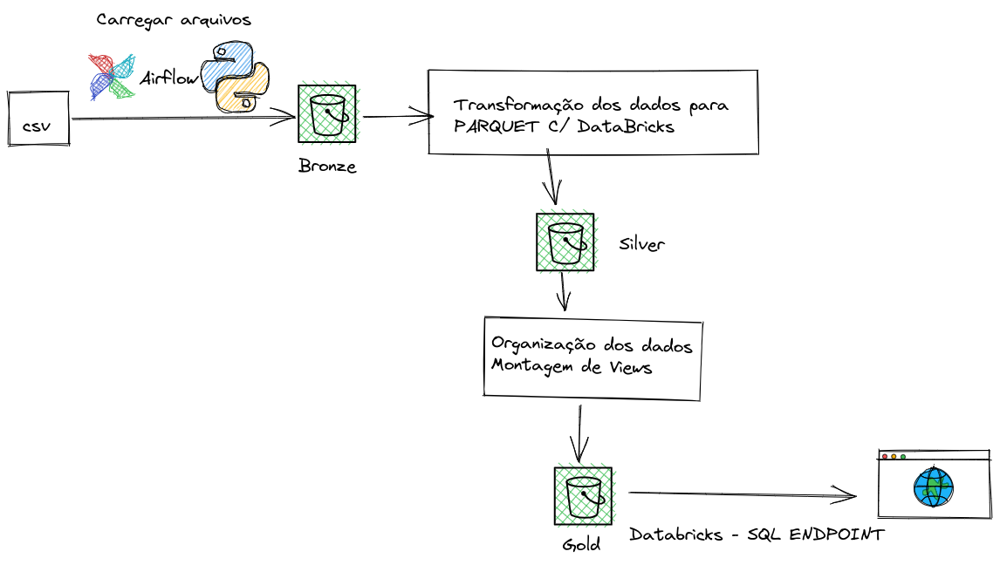
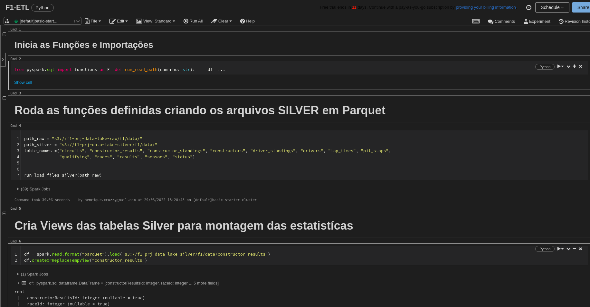
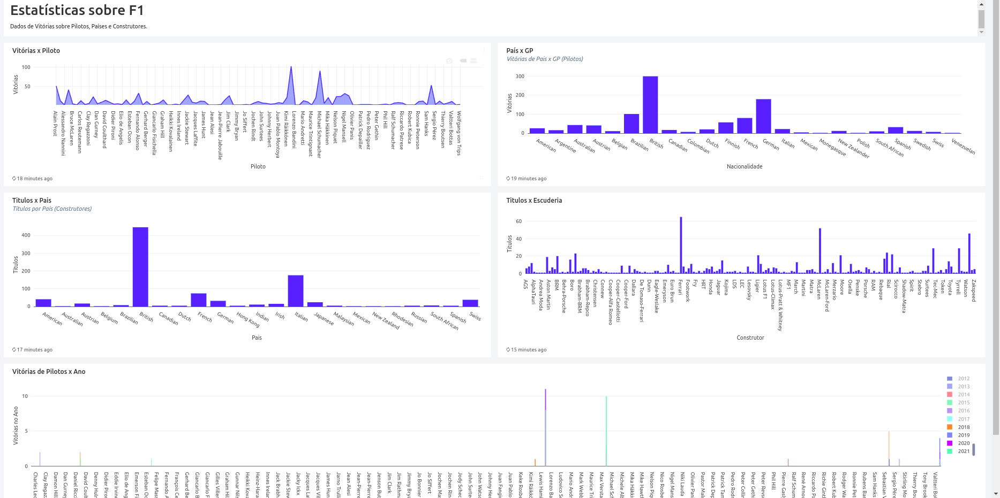

# Projeto de Conclusão Bootcamp Engenharia de dados v1.0

A idéia desse projeto é subir todos os dados como um grande processo de Ingestão via data-lake.
Passando por todas as camadas, como Bronze, Silver e Gold. 
Os dados utilizados foram do Kaggle referentes à competições de F1 de 1950 até 2021:
[Dataset](https://www.kaggle.com/rohanrao/formula-1-world-championship-1950-2020)

# Introdução

Foi Utilizado um Airflow padrão com instalação via Docker-Compose.
A pasta ./inputs foi mapeada para simular uma pasta de servidor onde o boto3 deverá percorrer, obter os dados e enviar os mesmos para o bucket pŕe-definido S3 - BRONZE. Após isso os dados são tratados por uma função criada em Pyspark que roda no ambiente do Databricks. E salvando esses dados numa camada SILVER e por último Views são geradas para visualização dos dados e estatisticas desejadas e Salvas no bucket GOLD.
Esses dados são acessados através de um SQL Endpoint da Databricks possibilitando alguns gráficos.

## Repo.py
Responsável por conter as funções vinculadas à s3. Checar se o Bucket existe e se não existir, o criar.

## Ingestor.py
Responsável por obter a lista de arquivos da pasta mapeada (/inputs). Após obter os arquivos deleta os mesmos da pasta.

## ETL
OS dados são salvos e particionados pela coluna EXTRACTED_AT que simboliza o dia em que foram salvos no s3.
No segundo passo, temos os tratamentos, criação dos metadados e colunas, além de salvar os arquivos em formato PARQUET.
O terceiro passo é a transformação desses dados em views para serem consumidas pelas ferramentas de BI.

## Databricks

Através do Databricks foi criado o pyspark Notebook para auxilio no ETL 
Configurado e criado o SQL Endpoint e Views p/ Demonstração dos dados.
Results em F1-Dashboard.pdf

